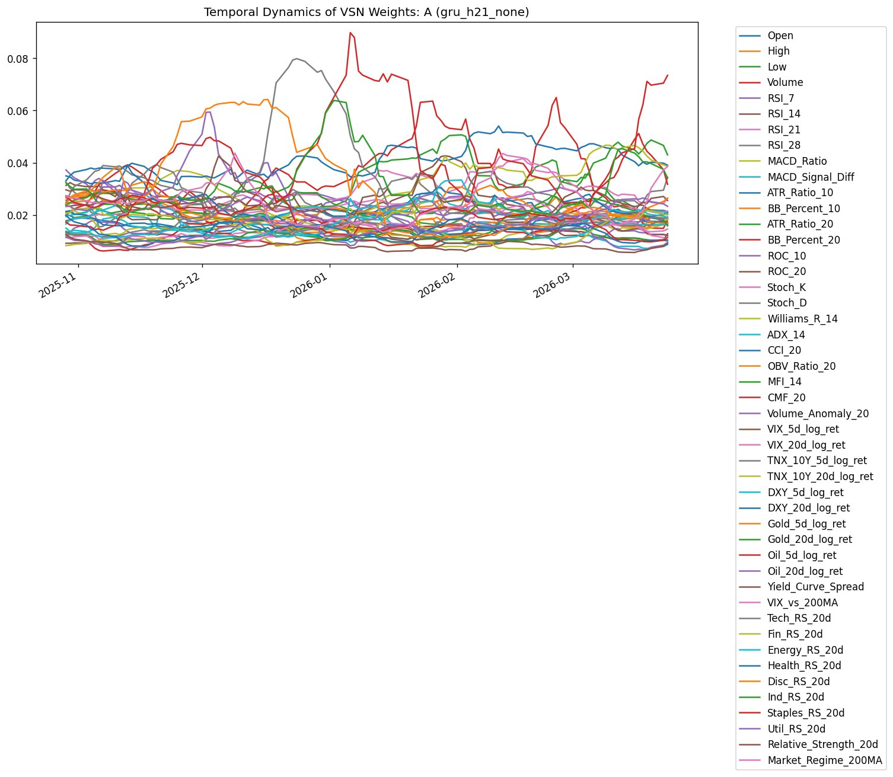
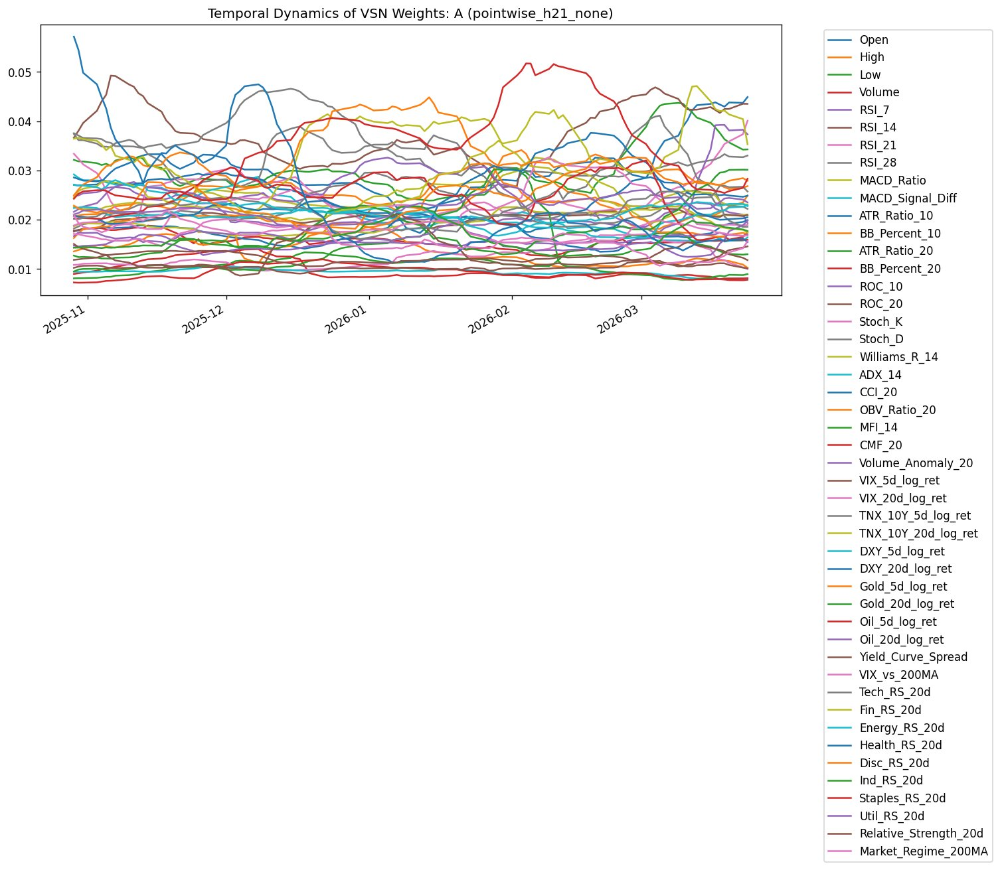

# iTransformer-XAI-Financial-Forecasting

미국 주식의 방향성을 **변수 축 attention(iTransformer 계열)**으로 예측하고,
**모델이 무엇을 보고 판단했는지(XAI)**를 분석하는 개인 프로젝트.

학부 팀 프로젝트 [tft-stock-forecasting](https://github.com/JunYoungHur/tft-stock-forecasting)의
후속 연구. 그 프로젝트가 남긴 두 숙제 — **이종 변수가 한 토큰에 뭉개지는 구조**,
**예측 근거를 설명할 수 없다는 점** — 에 답하려는 시도다.

> 완성된 예측 시스템이 아니라 진행 중인 연구다. 도달한 지점과 부딪힌 문제,
> 다음 방향을 함께 기록한다.

---

## 출발점

24년 팀 프로젝트는 TFT로 종가를 예측하는 회귀 모델이었다. 두 한계가 남았다.

- **변수 뭉개짐.** TFT는 한 시점의 모든 변수를 하나의 토큰으로 합쳐 시간 축에
  attention한다. 금리·거래량·종가처럼 성격이 다른 변수가 한 토큰 안에서 섞인다.
- **설명 불가.** 예측이 맞아도 왜 그렇게 판단했는지 알 수 없었다.

이후 [iTransformer](https://arxiv.org/abs/2310.06625)가 첫 번째 문제를 정면으로
다룬다는 것을 알게 됐다 — 시간 축이 아니라 **변수 축에 attention**을 거는 접근.
이 프로젝트는 그 위에서 두 번째 숙제(설명 가능성)까지 함께 다룬다.

## 설계

**회귀 → 분류.** 종가 회귀 대신, 변동성 기반 임계값으로 라벨링한 3진 방향 분류
(하락/횡보/상승, 21영업일). 이유: (1) 저 SNR에서 MSE는 출력이 직전 값으로 수렴하는
lagging이 강함(원본에서 관측), (2) 원시 가격은 비정상적이나 방향은 가격 수준에 불변,
(3) long/short/hold 판단엔 크기보다 방향이 중요.

**변수 축 attention.** 각 변수의 lookback window를 토큰 하나로 임베딩하고 변수
토큰 간 attention. "변수 뭉개짐" 숙제에 대한 답.

**학습된 변수 선택 게이트.** 변수를 사람이 고르는 건 주관적이라, 선택을 모델에 맡김.
TFT의 Variable Selection Network(VSN)를 변수 토큰화 직전에 두어 노이즈 변수를 누름.
여기에 GRU를 더해, 변수 중요도가 고정되지 않고 **시점까지의 시장 맥락에 따라
달라지도록** 함. "설명 가능성" 숙제에 대한 답.

**정규화 (RevIN).** 주가는 비정상적(non-stationary)이라 시기마다 평균·분산이
다르다. 전역 통계로 정규화하면 test 구간 통계가 섞이는 leakage가 생기고, train
통계로 고정하면 분포 변화에 취약하다. [RevIN](https://openreview.net/forum?id=cGDAkQo1C0p)은
각 입력 윈도우(인스턴스)를 그 자체 통계로 정규화해 두 문제를 동시에 피한다 —
윈도우 내부 통계만 쓰므로 leakage가 없고, 시기별 분포 변화에 자동으로 적응한다.

**파이프라인.**

```
RevIN  →  GRU 기반 변수 선택 게이트  →  변수-as-토큰 임베딩
       →  Transformer encoder (변수 축 attention)  →  GAP  →  MLP 분류기
```

**데이터.** Yahoo Finance S&P 500 일봉(2000~현재), 47개 피처.

- 종목별 기술 지표: RSI, MACD, ATR, Bollinger, ROC, Stochastic, Williams %R,
  ADX, CCI, OBV, MFI, CMF, 거래량 이상치
- 거시: VIX, 금리, 달러, 금, 원유, 장단기 금리차
- 섹터 상대강도: 8개 SPDR ETF의 SPY 대비

47개 전부를 사전 선택 없이 투입. 무관한 변수를 누르는 일은 학습된 게이트에 위임.

## 결과

Hold-out 테스트셋, horizon=21, T4 GPU. 랜덤 베이스라인 33.3%.

| 설정 | Test Acc | 상위 10% 확신 베팅 정확도 | 베팅 long 비율 |
|---|---:|---:|---:|
| 클래스 가중치 없음 | 38.2 % | 38.2 % | 49.6 % |
| Inverse 클래스 가중치 | 39.4 % | 13.8 % | 37.0 % |

정확도는 랜덤 근처. 21일 방향 예측의 난이도를 생각하면 예상된 결과이고, 핵심도
아니다. 주목할 관찰 둘.

- **클래스 가중치의 역설.** 불균형 보정용 inverse 가중치가 오히려 예측 분포를
  뒤집어, 하락을 데이터 비율(~26%)보다 많은 ~55%로 예측. 가중치를 빼니 예측이
  균형을 찾고 확신도가 의미를 가짐. 흔한 기법이 저 SNR에서 역효과를 내는 사례.
- **게이트가 보는 것.** 학습된 게이트는 변동성(ATR), 거시 국면(VIX, 장단기 금리차),
  방어 섹터에 무게를 둔다 — 경제적으로 납득되는 묶음. GRU 게이트의 가중치는 시간에
  따라 뚜렷이 변동하나, 시점 독립 게이트는 거의 평탄.

아래는 종목 A에 대한 시점별 변수 가중치(VSN) 변화다. 왼쪽(GRU)은 특정 변수가
국면에 따라 크게 출렁이는 반면, 오른쪽(시점 독립)은 좁은 띠 안에서 거의 평탄하다.

| GRU 게이트 | 시점 독립 게이트 |
|---|---|
|  |  |

분석 그림·실행별 지표는 `results/`. 단, VSN 가중치는 게이팅 단계의 변수 강조도이며,
이후의 변수 축 attention이 이를 다시 변형하므로 최종 예측 기여도와 1:1 대응은 아님.

## 한계

완성된 시스템이 아니라 제약 안의 탐구다. 한계를 숨기지 않는다.

- **생존 편향.** 종목 리스트가 *현재* S&P 500 구성. 2000년 이후 상장폐지·편출
  종목이 빠져 결과가 낙관적. 보정엔 시점별 구성종목 데이터 필요(무료 미제공).
- **짧은 out-of-sample.** 진짜 미래 구간 데이터가 몇 개월뿐. 단일 구간은 약한 증거.
- **낮은 SNR.** 21일 방향은 노이즈 수준. 33~39% 정확도는 버그가 아닌 과제 난이도.
- **불완전한 확신 보정.** 최선의 실행에서도 최고 확신 구간에서 정확도가 떨어짐.
- **해석 범위.** 게이트 가중치는 강조도이지 인과적 기여도가 아님.

## 의의

성능이 아니라 그 주변의 **아키텍처적·방법론적 탐구**에 의의를 둔다.

- 이종 금융 변수를 한 토큰에 섞지 않고 변수-as-토큰으로 다룸.
- 맥락 인식(GRU) 게이트가 정적 게이트와 다르게 동작하는지 검증하고, 숫자만
  보고하는 대신 그 동작을 분석.
- 흔한 기법(저 SNR에서 inverse 가중치)의 재현 가능한 실패를 문서화.
- 앞선 팀 프로젝트의 두 숙제(변수 뭉개짐, 설명 가능성)에 구체적 답을 시도하고
  그 한계까지 정리.

## 막힌 지점과 다음 수

발견한 문제와 그에 대한 다음 수를 짝지어 둔다.

- 최고 확신 구간 정확도 저하 → probability calibration(temperature scaling 등)
- inverse 가중치 역효과 → focal loss 기반 이진 two-head 재정의
- 단일 테스트 구간의 약한 증거 → rolling 평가
- horizon별 거동 미확인 → horizon sweep(5/10/21)과 변수 중요도 이동 분석
- 게이트 종류 효과의 정식 비교 → gru/pointwise/none ablation 표
- 생존 편향 → 시점별 구성종목 데이터 확보

## 저장소

```
src/             모델, 데이터 파이프라인, 학습, 분석
results/         실행별 JSON 요약·진단, 그림
analysis/        라벨 분포 민감도 등 독립 스크립트
requirements.txt
```

```bash
pip install -r requirements.txt
python src/main.py
```

첫 실행은 S&P 500 데이터를 내려받아 캐싱, 이후 재사용. 단일 학습 ≈ 50분(Colab T4).
변수 게이트(`gru`/`pointwise`/`none`)와 클래스 가중치(`none`/`sqrt`/`inverse`)는
설정에서 변경 가능.

---

학부 수준 개인 연구이며, 투자 판단의 근거가 아니다.
